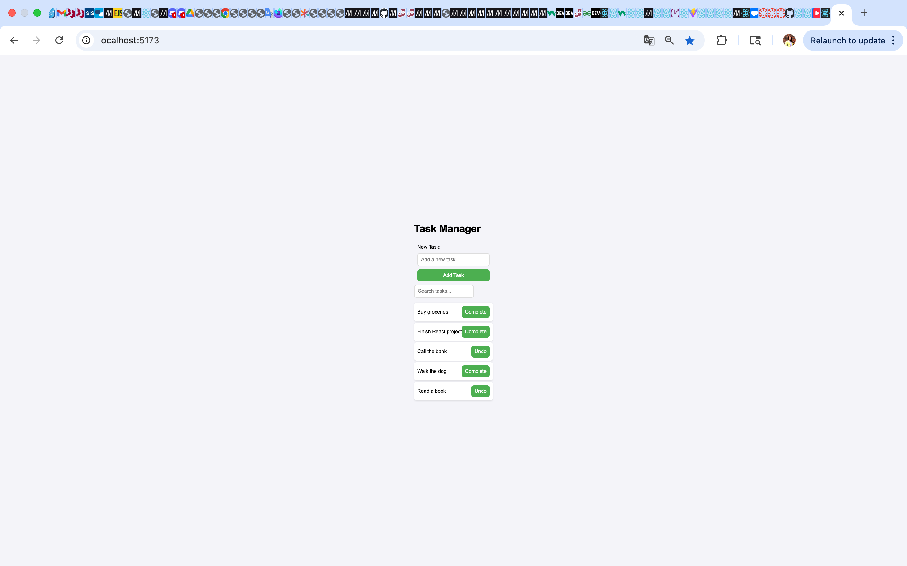

# Lab: Task Manager

## Overview
In this lab, we’ll build a Task Manager application that allows users to add, complete, and search tasks. Utilizing the hooks of `useRef` to persist values without re-rendering, `useId` to generate unique IDs for accessibility and controlled components, and `useContext` for global state management.

## Task 1: Define the Problem
The frontend is set up, but the application lacks interactivity and state management.

As a user, I should be able to:
- Add a new task using a form (`useId`)
- Mark tasks as completed (`useContext`)
- Search tasks dynamically (`useRef`)

## Task 2: Determine the Design
Determine state and props needed for each component:
- Global states (`useContext`)
- Persistent Values (`useRef`)
- Unique IDs (`useId`)

## Task 3: Develop the Code
### Implement Global State with `useContext`
- Create `TaskProvider` as global state within `TaskContext.jsx`
- Replace tasks state in app with context

### Mark Task
- Implement `toggleComplete` function within `TaskContext.jsx`
- Call `toggleComplete` upon clicking task button

### Submit Tasks
- Apply `useId` on form input
- Implement `addTask` function within `TaskContext.jsx`
- Call `addTask` within submit

### Implement Search Functionality
- Implement `useRef` on search input
- Implement filter on task context

## Task 4: Test and Refine
Debug and test during development using the provided test suite and React DevTools in Chrome.

## Task 5: Document and Maintain
- Commit as you go, writing meaningful commit messages
- Push commit history to GitHub periodically and when lab is complete

## Tools and Resources
- GitHub Repo: 
- `useRef`: [React useRef](https://react.dev/reference/react/useRef)
- `useContext`: [React useContext](https://react.dev/reference/react/useContext)
- `useId`: [React useId](https://react.dev/reference/react/useId)

## Instructions
### Set Up
Before we begin coding, let's complete the initial setup for this lesson:

#### Fork and Clone
- Go to the provided GitHub repository link.
- Fork the repository to your GitHub account.
- Clone the forked repository to your local machine.

#### Open and Run File
- Open the project in VSCode.
- Run `npm install` to install all necessary dependencies.

## Instructions
### Task 1: Define the Problem
The frontend is set up, but the application lacks interactivity and state management.

As a user, I should be able to:
- Add a new task using a form (`useId`)
- Mark tasks as completed (`useContext`)
- Search tasks dynamically (`useRef`)

### Task 2: Determine the Design
Determine state and props needed for each component.

### Task 3: Develop, Test, and Refine the Code
#### Open React application in browser
```sh
npm run dev
```

#### Run the included backend
```sh
npm run server
```

#### Run test suite
```sh
npm run test
```

### Create feature branch
#### Implement Global State with `useContext`
- Create `TaskProvider` as global state within `TaskContext.jsx`
- Replace tasks state in app with context
- Update `App` within `main.jsx` to be wrapped in `TaskProvider`

#### Mark Task
- Implement `toggleComplete` function within `TaskContext.jsx`
- Ensure `toggleComplete` function edits both the `db.json` and page
- Call `toggleComplete` upon clicking task button

#### Submit Tasks
- Apply `useId` on form input
- Implement `addTask` function within `TaskContext.jsx`
- Call `addTask` within submit

#### Implement Search Functionality
- Implement `useRef` on search input
- Implement filter task context on `TaskList`

### Push feature branch and open a PR on GitHub
- Merge to main

## Task 4: Document and Maintain
### Best Practice documentation steps:
- Add comments to code to explain purpose and logic
- Clarify intent/functionality of code to other developers
- Add screenshot of completed work included in Markdown in `README.md`
- Update `README.md` text to reflect the functionality of the application following [Make a README](https://makeareadme.com)
- Delete any stale branches on GitHub
- Remove unnecessary/commented-out code
- If needed, update `.gitignore` to remove sensitive data

## Submission
Once all tests are passing and working code is pushed to the GitHub main branch, submit your GitHub repo through Canvas using CodeGrade.

## Grading Criteria
The application passes all test suites.

Ensure the application:
- Loads tasks with context.
- Submits new task with `useId`
- Marks tasks as complete.
- Filters tasks shown on the page by a search input.

## Updates

### Implemented Features
- Added global state management using React Context.
- Implemented add, search, and toggle task completion functionality.
- Ensured accessibility with proper label ↔ input linking.
- All tests passed (`npm run test`).
- Verified in the browser with mock backend (json-server).

### Preview
